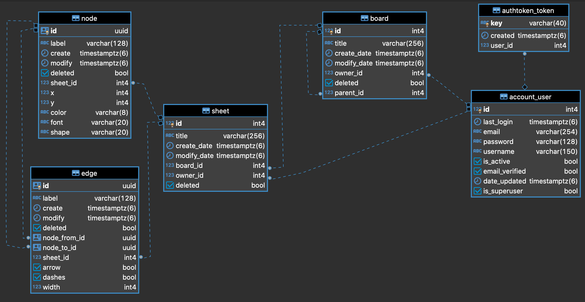

[돌아가기](https://github.com/LEEJ0NGWAN/FreeChart#개발자-문서)

## ERD

- account_user

    사용자를 저장하는 테이블입니다.

    - is_active 필드

        회원 탈퇴한 유저인지 식별하기 위한 boolean 타입의 필드입니다.

- authtoken_token

    jwt토큰을 저장하는 테이블입니다.

    - user_id

        Foreign Key: account_user.id

        해당 토큰에 관련된 사용자의 id값을 가집니다.

- board

    사용자 입장에서 폴더의 역할을 수행하는 개체들을 저장한 테이블입니다.

    - owner_id

        Foreign Key: account_user.id

        해당 보드를 소유한 사용자의 id값을 가집니다.

    - parent_id

        Foreign Key: board.id (재귀)

        부모 개체를 식별하기 위한 int 타입의 필드입니다.

        만약 어떤 보드가 다른 보드에 포함되는 경우, parent_id로 다른 보드의 id 값을 가지게 됩니다.

        어떤 보드에도 포함되지 않는 보드의 경우 parent_id의 값은 null입니다.

- sheet

    하나의 네트워크 그래프를 나타내는 개체를 저장한 테이블입니다.

    - owner_id

        Foreign Key: account_user.id

        해당 쉬트를 소유한 사용자의 id값을 가집니다.

    - parent_id

        Foreign Key: board.id

        부모 개체를 식별하기 위한 int 타입의 필드입니다.

        만약 어떤 보드에 포함되는 경우, parent_id에 부모 보드의 id 값을 가지게 됩니다.

        어떤 보드에도 포함되지 않는 쉬트의 경우 parent_id의 값은 null입니다.

- node

    어떤 쉬트에서 네트워크 그래프를 구성하는 원소의 정보를 저장하는 테이블입니다.

    - sheet_id

        Foreign Key: sheet.id

        해당 원소를 포함하는 쉬트의 id값을 가집니다.

    - shape

        원소가 어떤 모양인지 나타내는 필드입니다.

    - font

        원소의 글자 크기를 나타내는 필드입니다.

    - color

        원소의 색깔을 나타내는 필드입니다.

- edge

    어떤 쉬트에서 네트워크 그래프를 구성하는 원소들을 잇는 선의 정보를 저장하는 테이블입니다.

    - sheet_id

        Foreign Key: sheet.id

        선을 포함하는 쉬트의 id값을 가집니다.

    - node_from_id

        Foreign Key: node.id

        선의 시작점 원소의 id값을 가집니다.

    - node_to_id

        Foreign Key: node.id

        선의 끝점 원소의 id값을 가집니다.

    - arrow

        선의 끝 부분이 화살표 모양을 가지는지 유무를 나타내는 boolean 필드입니다.

    - dashes

        선이 점선인지를 나타내는 boolean 필드 입니다.

