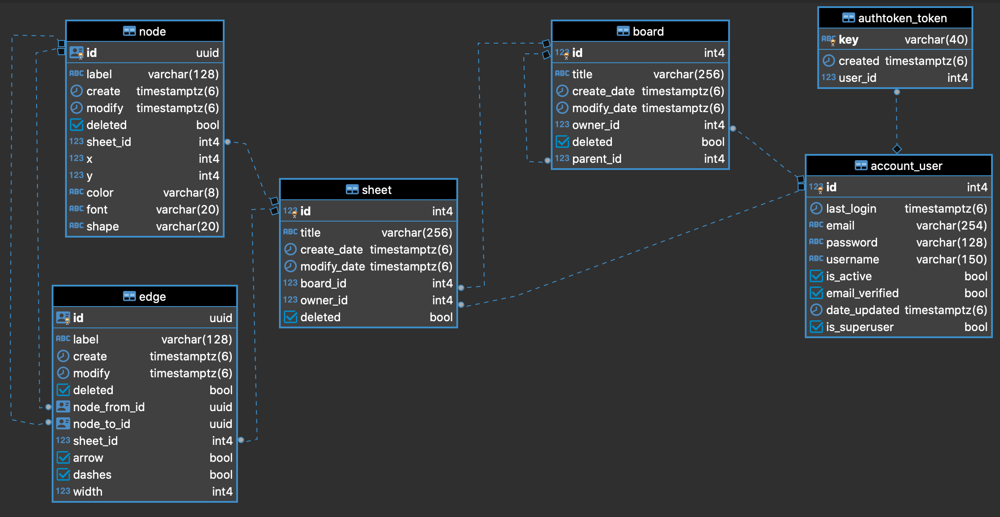

# FreeChart

[http://freechart.tk/](http://freechart.tk/)

React.js, Django Rest Framework, docker로 개발된 웹 기반 네트워크 그래프 작성 애플리케이션입니다.

## 어떻게 사용됩니까?

- 사용 환경

웹 애플리케이션으로, 디바이스 상관없이 와이파이와 웹 브라우저만 있다면 어디서나 사용 가능합니다.

- 사용 용도

중요 키워드를 모양으로 나타내고, 각각의 키워드를 서로 연결해서 관계를 나타내는 그림을 작성합니다.

마인드맵, 제조 공정도, 워크 프로세스, 관계도 등의 그래프를 작성하는데 사용될 수 있습니다.

<여러 디바이스에서 실행한 예제>


## 개발 스펙

### Front

- React.js (with yarn)
- React-redux
- React-router-dom
- vis-network

### Back

- Django
- DjangoRestFramework

### Other

- nginx
- PostgreSQL
- Redis
- Docker (Docker-compose)
- JWT authentication

## SPA (Single Page Application)

모든 동작이 하나의 페이지에서만 이루어지도록 만들었습니다.

SPA 구현을 위해, react-router-dom 패키지를 이용하여 리액트 컴포넌트 라우팅을 구현했습니다.

## Redux pattern

사용자 및 그래프 데이터와 같이 백엔드 서버로부터 api 호출을 통해 얻은 후, 여러 컴포넌트에서 공통으로 사용하는 데이터는 각 종류 별 reducer가 관리하며 하나의 store에 저장합니다.

react-thunk 패키지를 이용하여, api 호출과 같은 action에서 dispatch를 수행하여 정보가 비동기적으로 저장 될 수 있도록 했습니다.

## ORM

Django, Django Rest Framework를 이용하여, 데이터를 객체로 맵핑하는 ORM을 사용합니다

이를 통해, SQL 쿼리문 없이 여러 DB 테이블의 데이터들을 조작할 수 있는 REST api를 만들었습니다.

## JWT

클라이언트와 서버 간의 통신이 이루어질 때, 기존의 세션이나 쿠키를 사용하는 대신에 JWT 토큰을 이용하여 인증하는 방식을 적용시켰습니다.

JWT 토큰은 refresh를 통해서, 일부로 로그아웃하지 않는 이상 사용자는 최대 2주 동안 접속이 유지될 수 있습니다. 이를 통해 사용자가 번거로운 로그인 과정 없이 지난번의 작업을 이어서 할 수 있도록 설정했습니다.

또, 백엔드 django api 서버가 세션 유지를 하지 않아 완전한 stateless로 동작합니다.

이를 통해 서버는 온전히 비즈니스 로직에만 자원을 사용할 수 있기 때문에 성능의 향상을 기대할 수 있습니다.

## Docker (with Docker-compose)

컨테이너 기반으로 구동하는 방식을 통해, FreeChart 웹 애플리케이션의 각 컴포넌트들이 사용하는 자원을 최적으로 줄이고, 각 컴포넌트들의 버전을 쉽게 관리할 수 있도록 도커라이징을 적용했습니다.

docker-compose로 실행되는 서비스들은 다음과 같습니다.

- front

    프로덕션 배포용 front app을 빌드

    nginx 컨테이너와 volume을 공유

- back

    REST api 서버

- nginx

    front 컨테이너에서 빌드된 app을 탑재

    api request를 api 서버로 전달하는 proxy pass 수행

- postgreSQL

    사용자의 데이터를 저장하는 데이터베이스

- redis

    인증코드를 저장하는 key-value 데이터베이스

<br/> 
<br/> 
  
# 개발자 문서
- [api](#api)

- [Local 개발 설정 방법](#local-개발-모드-설정-방법)  

- [Local 개발 실행 방법](#local-개발-모드-실행-방법)  

- [Production 설정 방법](#production-배포-설정-방법)  

- [Production 시작 방법](#production-시작-방법)  

- [Production 업데이트 방법](#production-업데이트-방법)  

- [Docker 관련 사항](#docker-관련-사항)  

- [ERD](#erd)  

- [향후 개선 계획](#향후-개선-계획)  

<br/>  

## api

api 서버 호스트를 생략하고, 하위 경로만 기술합니다.

예를 들어, `/account/login/`는 `http://api서버/account/login/` 을 나타냅니다.

POST와 PUT 메소드는 통상적으로 json 데이터 형식을 이용합니다. (예외 별도 표시)

리퀘스트에서 등장하는 물음표 `?` 는 해당 파라매터가 필수 요소가 아님을 나타내기 위해 사용됩니다.

## 1. 계정 관련 api

### [POST] /account/login/

로그인 api

- request

```jsx
{
	email,
	password
}
```

- response [성공]: 200

```jsx
{
	refresh,	// JWT 갱신 토큰
	access,		// JWT 인증 토큰
	user: {
		id,
		email,
		username
	}
}
```

- response [실패]: 400

```jsx
// 리퀘스트 데이터가 잘못된 경우
{
	error
}
```

- response [실패]: 404

```jsx
// 사용자가 존재하지 않을 경우
{
	error
}
```

### [POST] /account/email/verify/

계정 인증 api

데이터 없이 리퀘스트를 보내면 인증 메일을 전송합니다.

토큰과 이메일을 전달하면, 해당 이메일의 인증을 수행합니다.

- request

```jsx
{
	token?,		// email과 같이 전달되어야 합니다.
	email?		// token과 같이 전달되어야 합니다.
}
```

- response [성공]: 200

```jsx
{}
```

- response [실패]: 400

```jsx
// 리퀘스트 데이터가 잘못된 경우
{
	error
}
```

- response [실패]: 404

```jsx
// 해당 이메일의 사용자가 없거나 토큰이 redis에 없는 경우(시간 만료)
{
	error
}
```

### [POST] /account/password/reset/

비밀번호 초기화 api

데이터 없이 리퀘스트를 보내면 비밀번호 초기화 메일을 전송합니다.

토큰과 이메일을 전달하면, 계정 비밀번호 초기화를 수행합니다.

- request

```jsx
{
	token?,  // email과 같이 전달되어야 합니다.
	email?   // token과 같이 전달되어야 합니다.
}
```

- response [성공]: 200

```jsx
// 비밀번호 초기화 메일 전송을 성공한 경우
{}
```

- response [성공]: 302  (JSON response가 아닙니다!)

```jsx
// 메일에서 비밀번호 초기화 버튼을 누른 경우
// 메인 페이지로 리디렉션됩니다.
```

- response [실패]: 400

```jsx
// 리퀘스트 데이터가 잘못된 경우
{
	error
}
```

- response [실패]: 404

```jsx
// 해당 이메일의 사용자가 없거나 토큰이 redis에 없는 경우(시간 만료)
{
	error
}
```

### [POST] /account/check/

이메일 중복 검사 api

- request

```jsx
{
	email
}
```

- response [성공]: 200

```jsx
// boolean 데이터를 반환합니다.
// true: 사용 가능한 이메일
// false: 이미 존재하는 이메일
{
	email:boolean
}
```

- response [실패]: 400

```jsx
// 리퀘스트 데이터에 이메일이 없는 경우
{
	error
}
```

### [POST] /account/create/

신규 사용자 생성 api

- request

```jsx
{
	email,
	password,
	username?	// username이 전달되지 않으면, 사용자의 닉네임은 이메일이 됩니다.
}
```

- response [성공]: 200

```jsx
{
	refresh,	// JWT 갱신 토큰
	access,		// JWT 인증 토큰
	user: {
		id,
		email,
		username
	}
}
```

- response [실패]: 400

```jsx
// 리퀘스트 데이터가 잘못된 경우
{
	error
}
```

- response [실패]: 409

```jsx
// 해당 이메일로 등록된 사용자가 이미 있는 경우
{
	error
}
```

### [POST] /account/delete/

사용자(본인) 정보 삭제 api

- request

```jsx
{
	id,		// 현재 접속된 사용자 자신의 id
	password	// 현재 접속된 사용자 자신의 패스워드
}
```

- response [성공]: 200

```jsx
{}
```

- response [실패]: 400

```jsx
// 리퀘스트 데이터가 잘못된 경우
{
	error
}
```

- response [실패]: 401

```jsx
// jwt 인증 실패의 경우
{}
```

### [POST] /account/refresh/

jwt 토큰 인증 기간 재갱신 api

- request

```jsx
{
	refresh  // JWT 갱신 토큰
}
```

- response [성공]: 200

```jsx
{}
```

- response [실패]: 401

```jsx
// jwt 인증 실패의 경우
{}
```

### [POST] /account/verify/

jwt 토큰 인증 테스트 api

- request

```jsx
{}
```

- response [성공]: 200

```jsx
{}
```

- response [실패]: 401

```jsx
// jwt 인증 실패의 경우
{}
```

## 2. 사용자 관련 api

### [GET] /user/

사용자 조회 api

- request

```jsx
{
	id?	// 사용자의 아이디를 전달하면 해당 id의 사용자를 조회합니다.
}
```

- response [성공]: 200

```jsx
{
	user: {
		id,
		email,
		username
	}
}
```

- response [실패]: 401

```jsx
// jwt 인증 실패의 경우
{}
```

- response [실패]: 404

```jsx
// 전달받은 사용자 id에 해당하는 사용자가 없는 경우
{}
```

### [PUT] /user/

사용자 정보 수정 api

닉네임과 비밀번호를 변경하는 api 입니다.

- request

```jsx
{
	username?	// 새로운 닉네임
	password?	// 새로운 비밀번호
}
```

- response [성공]: 200

```jsx
{
	user: {
		id,
		email,
		username
	}
}
```

- response [실패]: 401

```jsx
// jwt 인증 실패의 경우
{}
```

## 3. 보드 관련 api

### [GET] /board/

현재 사용자의 보드(폴더) 조회 api

다음과 같은 3가지 기능을 제공합니다.

- 특정 보드의 조회                           (id 파라매터)
- 특정 보드에 포함된 보드들 조회   (parent_id 파라매터)
- 현재 사용자의 모든 보드 조회       (파라매터 없음)
- request

```jsx
{
	id?		// 특정 보드를 조회하고 싶을 때 전달
	parent_id?	// 특정 보드에 포함된 보드들을 조회하고 싶을 때 전달
  	order?		// 조회될 보드들의 정렬순서입니다. (기본값: 수정일짜 내림차순)
}
```

사용 가능한 order 패러매터의 값은 다음과 같습니다. (마이너스 부호는 내림차순을 의미)

`-modify_date`  `-create_date`  `-title`  `modify_date`  `create_date`  `title`

- response [성공]: 200 (특정 보드를 조회)

```jsx
{
	board: {
		id,
		title,
		parent_id,	// 가장 바깥에 존재하는 보드는 이 값이 null입니다.
		create_date,
		modify_date
	}
}
```

- response [성공]: 200 (특정 보드에 포함된 보드들을 조회)

```jsx
{
	boards: [
		{
			id,
			title,
			parent_id,	// 요청했던 특정 보드의 id값이 됩니다.
			create_date,
			modify_date
		},
		...
	]
}
```

- response [성공]: 200 (현재 사용자의 모든 보드를 조회)

```jsx
{
	boards: [
		{
			id,
			title,
			parent_id,
			create_date,
			modify_date
		},
		...
	]
}
```

- response [실패]: 401

```jsx
// jwt 인증 실패의 경우
{}
```

- response [실패]: 404

```jsx
// 전달받은 id에 해당하는 보드가 없을 경우
{}
```

### [POST] /board/

보드 생성 api

- request

```jsx
{
	title,		// 만들고 싶은 보드의 제목
	parent_id?	// 부모로 삼을 특정 보드의 id
}
```

- response [성공]: 200

```jsx
{
	board: {
		id,
		title,
		parent_id,	// 가장 바깥에 존재하는 보드는 이 값이 null입니다.
		create_date,
		modify_date
	}
}
```

- response [실패]: 400

```jsx
// 리퀘스트 데이터가 잘못된 경우
{}
```

- response [실패]: 401

```jsx
// jwt 인증 실패의 경우
{}
```

### [PUT] /board/

보드 수정 api

- request

```jsx
{
	id,		// 수정할 보드의 id
	title?,		// 새로 적용할 제목
parent_id?		// 새로 적용할 상위 보드의 id
}
```

- response [성공]: 200

```jsx
{
	board: {
		id,
		title,
		parent_id,	// 가장 바깥에 존재하는 보드는 이 값이 null입니다.
		create_date,
		modify_date
	}
}
```

- response [실패]: 400

```jsx
// 리퀘스트 데이터가 잘못된 경우 (보드의 id가 없는 경우)
{}
```

- response [실패]: 401

```jsx
// jwt 인증 실패의 경우
{}
```

- response [실패]: 404

```jsx
// 전달받은 id에 해당되는 보드가 없는 경우
{}
```

### [POST] /board/delete/

보드 삭제 api

- request

```jsx
{
	id,			// 삭제 할 보드의 id
	save_child?: boolean	// 삭제 할 보드에 포함되었던 자식(보드,쉬트)의 삭제 방지 여부
				// (기본값: false <- 같이 삭제)
}
```

- response [성공]: 200 (자식도 같이 삭제했을 경우)

```jsx
{
  // 삭제된 보드의 정보
	board: {
		id,
		title,
		parent_id,
		create_date,
		modify_date
	}
}
```

- response [성공]: 200 (자식은 삭제하지 않은 경우)

```jsx
{
  // 삭제된 보드의 정보
	parent: {
		id,
		title,
		parent_id,
		create_date,
		modify_date
	},
  // 복구한 자식들의 정보
	boards: [
		{
			id,
			title,
			parent_id,	// 삭제된 보드의 부모, 즉, 조부모로 연결됩니다.
			create_date,
			modify_date
		},
		...
	],
	sheets: [
		{
			id,
			title,
			board_id,	// 삭제된 보드의 부모, 즉, 조부모로 연결됩니다.
			create_date,
			modify_date
		},
		...
	]
}
```

- response [실패]: 400

```jsx
// 리퀘스트 데이터가 잘못된 경우 (보드의 id가 없는 경우)
{}
```

- response [실패]: 401

```jsx
// jwt 인증 실패의 경우
{}
```

- response [실패]: 404

```jsx
// 전달받은 id에 해당되는 보드가 없는 경우
{}
```

## 4. 쉬트 관련 api

### [GET] /sheet/

현재 사용자의 쉬트(네트워크 그래프) 조회 api

다음과 같은 3가지 기능을 제공합니다.

- 특정 쉬트의 조회                           (id 파라매터)
- 특정 보드에 포함된 쉬트들 조회   (board_id 파라매터)
- 현재 사용자의 모든 쉬트 조회       (파라매터 없음)
- request

```jsx
{
	id?		// 특정 보드를 조회하고 싶을 때 전달
	board_id?	// 특정 보드에 포함된 보드들을 조회하고 싶을 때 전달
	order?		// 조회할 쉬트들의 정렬순서입니다. (기본값: 수정일짜 내림차순)
}
```

사용 가능한 order 패러매터의 값은 다음과 같습니다. (마이너스 부호는 내림차순을 의미)

`-modify_date`  `-create_date`  `-title`  `modify_date`  `create_date`  `title`

- response [성공]: 200 (특정 쉬트를 조회)

```jsx
{
	sheet: {
		id,
		title,
		board_id,	// 가장 바깥에 존재하는 쉬트는 이 값이 null입니다.
		create_date,
		modify_date
	}
}
```

- response [성공]: 200 (특정 보드에 포함된 쉬트들을 조회)

```jsx
{
	sheets: [
		{
			id,
			title,
			board_id,	// 요청했던 특정 보드의 id값이 됩니다.
			create_date,
			modify_date
		},
		...
	]
}
```

- response [성공]: 200 (현재 사용자의 모든 쉬트를 조회)

```jsx
{
	sheets: [
		{
			id,
			title,
			board_id,
			create_date,
			modify_date
		},
		...
	]
}
```

- response [실패]: 401

```jsx
// jwt 인증 실패의 경우
{}
```

- response [실패]: 404

```jsx
// 전달받은 id에 해당하는 보드가 없을 경우
{}
```

### [POST] /sheet/

쉬트 생성 api

- request

```jsx
{
	title,		// 만들고 싶은 쉬트의 제목
	board_id?	// 부모로 삼을 특정 보드의 id
}
```

- response [성공]: 200

```jsx
{
	sheet: {
		id,
		title,
		board_id,	// 가장 바깥에 존재하는 쉬트는 이 값이 null입니다.
		create_date,
		modify_date
	}
}
```

- response [실패]: 400

```jsx
// 리퀘스트 데이터가 잘못된 경우
{}
```

- response [실패]: 401

```jsx
// jwt 인증 실패의 경우
{}
```

### [PUT] /sheet/

쉬트 수정 api

- request

```jsx
{
	id,		// 수정할 쉬트의 id
	title?,		// 새로 적용할 제목
	board_id?	// 새로 적용할 상위 보드의 id
}
```

- response [성공]: 200

```jsx
{
	sheet: {
		id,
		title,
		board_id,	// 가장 바깥에 존재하는 쉬트는 이 값이 null입니다.
		create_date,
		modify_date
	}
}
```

- response [실패]: 400

```jsx
// 리퀘스트 데이터가 잘못된 경우 (쉬트의 id가 없는 경우)
{}
```

- response [실패]: 401

```jsx
// jwt 인증 실패의 경우
{}
```

- response [실패]: 404

```jsx
// 전달받은 id에 해당되는 쉬트가 없는 경우
{}
```

### [DELETE] /sheet/

보드 삭제 api

- request

```jsx
{
	id	// 삭제 할 쉬트의 id
}
```

- response [성공]: 200

```jsx
{
  // 삭제된 쉬트의 정보
	sheet: {
		id,
		title,
		board_id,
		create_date,
		modify_date
	}
}
```

- response [실패]: 400

```jsx
// 리퀘스트 데이터가 잘못된 경우 (쉬트의 id가 없는 경우)
{}
```

- response [실패]: 401

```jsx
// jwt 인증 실패의 경우
{}
```

- response [실패]: 404

```jsx
// 전달받은 id에 해당되는 쉬트가 없는 경우
{}
```

### [POST] /sheet/copy/

특정 쉬트를 복제하는 api

- request

```jsx
{
	sheet_id	// 복제할 쉬트의 id
}
```

- response [성공]: 200

```jsx
{}
```

- response [실패]: 400

```jsx
// 리퀘스트 데이터가 잘못된 경우 (쉬트의 id가 없는 경우)
{}
```

- response [실패]: 401

```jsx
// jwt 인증 실패의 경우
{}
```

- response [실패]: 404

```jsx
// 전달받은 id에 해당되는 쉬트가 없는 경우
{}
```

## 5. 보드, 쉬트 관련 기타 api

### [GET] /child/

기준 위치에 포함된 보드와 쉬트를 가져오는 api

- request

```jsx
{
	id?,	// 기준이 될 보드의 id (기본값: null)
		// null의 경우, 가장 바깥(root)에 위치한 보드와 쉬트를 가져옵니다.

	order?	// 조회될 자식들의 정렬순서입니다. (기본값: 수정일짜 내림차순)
}
```

사용 가능한 order 패러매터의 값은 다음과 같습니다. (마이너스 부호는 내림차순을 의미)

`-modify_date`  `-create_date`  `-title`  `modify_date`  `create_date`  `title`

- response [성공]: 200

```jsx
{
  // 기준 위치에 해당되는 보드 (null의 경우, 빈 객체가 반환됩니다.)
	parent: {
		id,
		title,
		parent_id,
		create_date,
		modify_date
	},
  // 자식들의 정보
	boards: [
		{
			id,
			title,
			parent_id,
			create_date,
			modify_date
		},
		...
	],
	sheets: [
		{
			id,
			title,
			board_id,
			create_date,
			modify_date
		},
		...
	]
}
```

- response [실패]: 401

```jsx
// jwt 인증 실패의 경우
{}
```

- response [실패]: 404

```jsx
// 전달받은 id에 해당되는 보드가 없는 경우
{}
```

## 6. 원소 api

### [GET] /sheet/element/

특정 쉬트(네트워크 그래프)를 구성하는 원소(노드, 엣지)의 데이터를 가져오는 api

- request

```jsx
{
	sheet_id
}
```

- response [성공]: 200

```jsx
{
	// 네트워크를 구성하는 노드와 엣지의 정보
	nodes: [
		{
			id,
			label,		// 노드가 표시하는 텍스트
			x,		// 노드의 좌표 값
			x_,
			y,
			y_,
			font: int,	// 노드의 글자 크기
			shape,		// 노드의 모양
			color		// 노드의 색
		},
		...
	],
	edges: [
		{
			id,
			label,			// 엣지가 표시하는 텍스트
			from,			// 엣지의 시작점 노드 id
			to,			// 엣지의 끝점 노드 id
			dashes: boolean,	// 엣지의 점선 여부
			width:  int,		// 엣지의 굵기
			arrow:  boolean,	// 엣지의 끝 부분의 화살표 여부
			arrows: {
				to: {
					type,			// 화살표가 있을 경우 유형 (arrow, image)
					scaleFactor: int	// 화살표가 있을 경우 크기
				}
			}
		},
		...
	]
}
```

- response [실패]: 400

```jsx
// 리퀘스트 데이터가 잘못된 경우 (쉬트의 id가 없는 경우)
{}
```

- response [실패]: 401

```jsx
// jwt 인증 실패의 경우
{}
```

- response [실패]: 404

```jsx
// 전달받은 id에 해당되는 쉬트가 없는 경우
{}
```

### [POST] /sheet/element/

특정 쉬트(네트워크 그래프)를 구성하는 원소(노드, 엣지)의 데이터를 조작하는 api

- request

```jsx
{
	sheet_id,
	// 변경된 원소들의 최신 정보(가장 마지막 형태)를 담은 JSON 배열
	nodes: [
		{
			id,
			label,		// 노드가 표시하는 텍스트
			x,		// 노드의 좌표 값
			x_,
			y,
			y_,
			font: int,	// 노드의 글자 크기
			shape,		// 노드의 모양
			color		// 노드의 색
		},
		...
	],
	edges: [
		{
			id,
			label,			// 엣지가 표시하는 텍스트
			from,			// 엣지의 시작점 노드 id
			to,			// 엣지의 끝점 노드 id
			dashes: boolean,	// 엣지의 점선 여부
			width:  int,		// 엣지의 굵기
			arrow:  boolean,	// 엣지의 끝 부분의 화살표 여부
			arrows: {
				to: {
					type,			// 화살표가 있을 경우 유형
					scaleFactor: int	// 화살표가 있을 경우 크기
				}
			}
		},
		...
	],
	nodeStates: {
		node1_id: 0,
		node2_id: 1,
		node3_id: 2,
		...
	},
	edgeStates: {
		edge1_id: 0,
		edge2_id: 1,
		edge3_id: 2,
		...
	}
}
```

nodes와 edges 파라매터는 각각 변경한 원소들의 최신 정보(가장 마지막 모습)를 나타냅니다.

nodeStates와 edgeStates 파라매터는 각각 변경한 원소들이 어떤 식으로 변경되었는지를 나타냅니다.

변경된 원소들을 key로 하고, 해당 원소의 변경 모드를 value로 가집니다.

변경 모드는 `0:삭제` `1:생성` `2:수정` 으로 구성되며 각 모드를 나타내는 숫자(0, 1, 2)를 value로 표현합니다.

- response [성공]: 200

```jsx
{}
```

- response [실패]: 400

```jsx
// 리퀘스트 데이터가 잘못된 경우
{}
```

- response [실패]: 401

```jsx
// jwt 인증 실패의 경우
{}
```

- response [실패]: 404

```jsx
// 전달받은 sheet_id에 해당되는 쉬트가 없는 경우
{}
```

<br/>  

[개발자 문서로 돌아가기](#개발자-문서)  

## Local 개발 모드 설정 방법

(Mac OS에서 진행되었으며, 윈도우 환경에서 개발 설정 방법은 다를 수 있습니다.)

- 프로젝트 다운로드

    터미널에서 다음의 명령어를 실행합니다.

```jsx
// 프로젝트 설정들은 홈 디렉토리 아래에 프로젝트가 있음을 가정하고 진행합니다.
// 홈 디렉토리로 이동
cd

// 프로젝트 다운로드
git clone https://github.com/LEEJ0NGWAN/FreeChart.git
```

- 로컬 데이터베이스 설치

    터미널에서 다음의 명령어를 실행합니다. 

```jsx
// Homebrew 유틸을 이용하여 설치합니다.
// Homebrew가 없다면 먼저 Homebrew를 설치하거나, 
// postgreSQL과 redis를 각각의 공식 홈페이지에서 직접 설치해주세요.
brew install postgresql redis

// postgreSQL과 redis가 동작하고 있는지 확인
brew services

// 설치 완료 후, postgreSQL 연결
psql

// 로컬 DB와 사용자를 생성하고 권한을 부여
// 모든 이름과 패스워드는 freechart로 통일시키겠습니다.
drop database freechart;
create database freechart;
create user freechart with encrypted password 'freechart';
grant all privileges on database freechart to freechart;

// postgreSQL 연결 종료
\q
```

- 개발 호스트네임 설정

    터미널에서 다음의 명령어를 실행합니다.

```jsx
// vim과 같은 편집기를 이용하여 /etc/hosts 파일에 접근합니다.
sudo vim /etc/hosts

// 다음의 호스트네임을 /etc/hosts 파일에 추가해주세요.
127.0.0.1	freechart.local
```

- 로컬 nginx 서버 설정

    터미널에서 다음의 명령어를 실행합니다.

```jsx
// Homebrew를 이용한 nginx 설치
brew install nginx

// 정상적으로 동작하고 있는지 확인
brew services

// 프로젝트 루트 디렉토리로 이동
// 프로젝트를 다른 경로에 설치했다면, 그 경로에 맞게 이동해주세요.
cd ~/FreeChart

// nginx 로컬 설정 파일 복사
// brew를 사용하지 않는 방식으로 설치된 nginx의 경우, 경로가 다르므로 주의해주세요.
cp ./nginx/freechart.local.conf /usr/local/etc/nginx/servers

// nginx 재시작
brew services reload nginx
```

- 백엔드 api 서버 세팅

    터미널에서 다음의 명령어를 실행합니다.

```jsx
// 먼저 파이썬3와 pip3의 설치 유무를 확인해주세요
// 프로젝트 개발 기준 버전은 다음과 같습니다.
// python 3.7.6
// pip 20.2.2

// 프로젝트 루트 디렉토리로 이동
// 프로젝트를 다른 경로에 설치했다면, 그 경로에 맞게 이동해주세요.
cd ~/FreeChart

// python3 기준 venv라는 이름의 가상환경 생성
python3 -m venv venv

// 가상환경 실행
source venv/bin/activate

// api 서버 애플리케이션의 루트 폴더로 이동
cd back

// 의존성 설치
pip3 install -r requirements.txt

// 데이터베이스 마이그레이션
python3 manage.py migrate

// 만약, 개발을 하면서 ORM 관련하여 모델의 수정이 있을 경우,
// 개발 서버를 잠시 종료한 뒤,
// 다음의 명령어를 실행하여 데이터베이스에 모델의 변경사항을 매번 적용시켜 주세요.
python3 manage.py makemigrations // 새로운 마이그레이션 파일 생성
python3 manage.py migrate // 새로 만든 마이그레이션을 로컬 DB에 적용
```

- SMTP 호스트 설정

    네이버 아이디를 필요로 합니다.

    만약, 사용하려는 네이버 아이디가 2차 로그인 보안이 설정되어 있을 경우 사용하지 못합니다.

    1. 네이버에 로그인 합니다.

    2. 메일로 이동 합니다.

    3. 메일의 메인 화면에서 좌측 하단의 환경설정을 눌러주세요.

    4. 환경설정에서 POP3/IMAP 설정으로 이동해주세요.

    5. IMAP/SMTP 탭으로 이동 후, 사용함으로 체크하고 확인을 눌러주세요.

    6. FreeChart/back/FreeChart/email_setting.py 을 수정합니다.

    ```jsx
    EMAIL_HOST_USER = '아이디@naver.com'
    EMAIL_HOST_PASSWORD = '비밀번호'
    ```

7. 터미널에서 다음의 명령어를 실행합니다.

```jsx
// git에서 변경사항을 무시하도록 설정
// 프로젝트를 다른 경로에 설치했다면, 그 경로에 맞게 바꿔주세요.
git update-index --assume-unchanged ~/FreeChart/back/FreeChart/email_setting.py
```

- 프론트 애플리케이션 설정

    터미널에서 다음의 명령어를 실행합니다.

```jsx
// 먼저 node.js와 yarn의 설치 유무를 확인해주세요
// 프로젝트 개발 기준 버전은 다음과 같습니다.
// node 14.8.0
// yarn 1.22.4

// 프로젝트 루트 디렉토리로 이동
// 프로젝트를 다른 경로에 설치했다면, 그 경로에 맞게 이동해주세요.
cd ~/FreeChart

// 프론트 애플리케이션 폴더로 이동
cd front

// 의존성 설치
yarn
```

<br/>

[개발자 문서로 돌아가기](#개발자-문서)

## Local 개발 모드 실행 방법

api 서버와 프론트 애플리케이션을 위해 총 2개의 터미널이 필요합니다.

실행 시킨 후에,    [http://freechart.local/](http://freechart.local/)   로 접속할 수 있습니다.

- 확인 사항

    반드시 수행할 필요는 없습니다.

```jsx
// Homebrew를 이용하여 설치가 되었을 때를 가정합니다.
// 만약 다른 방법으로 설치했다면, 경로나 확인 방법이 다를 수 있습니다.

// nginx, postgreSQL, redis가 작동 중인지 확인합니다.
brew services

// nginx 관련 설정을 확인합니다.
cat /etc/hosts
cat /usr/local/etc/nginx/servers/freechart.local.conf

// SECRET KEY와 SMTP 이메일 호스트 설정을 확인합니다.
cd ~/FreeChart/back/FreeChart
cat email_setting.py
cat secret_key.py

// 백엔드 api 서버의 마이그레이션을 확인합니다.
cd ~/FreeChart
source venv/bin/activate
cd back
python3 manage.py migrate
```

- api 서버 실행

    터미널에서 다음의 명령어를 실행합니다.

```jsx
// 프로젝트 루트
cd ~/FreeChart

// 가상환경 진입
source venv/bin/activate

// 백엔드 루트로 이동
cd back

// 실행
python3 manage.py runserver
```

- 프론트 애플리케이션 실행

    터미널에서 다음의 명령어를 실행합니다.

```jsx
// 프론트 애플리케이션 루트로 이동
cd ~/FreeChart/front

// 프론트 개발 모드 실행
yarn start
```

<br/>

[개발자 문서로 돌아가기](#개발자-문서)

## Production 배포 설정 방법

- 요구 사항
    - AWS EC2 혹은 FreeChart를 실행시킬 수 있는 컴퓨터

        (git, docker, docker-compose가 설치 되어 있어야합니다.)

    - 개인 도메인

        위의 컴퓨팅 서비스와 연결 되어 있어야합니다.

    - Daum 스마트워크 SMTP

        위의 개인 도메인과 연결된 다음의 스마트워크 계정이 필요합니다.

- 프로젝트 다운로드 (필수)

    ec2의 터미널에서 다음의 명령어를 실행합니다.

```jsx
git clone https://github.com/LEEJ0NGWAN/FreeChart.git
```

- 데이터베이스 환경 변수 설정 (선택)

    ec2의 터미널에서 다음의 명령어를 실행합니다.

```jsx
// 홈 디렉토리에 프로젝트가 있다고 가정합니다.

// git에서 변경 사항을 무시하도록 설정합니다.
git update-index --assume-unchanged ~/FreeChart/postgres.env

// vim으로 api 서버의 환경 파일 진입
sudo vim ~/FreeChart/postgres.env
```

      환경 변수는 다음과 같습니다.

```jsx
// DB의 이름
POSTGRES_DB=freechart-monolithic-prod

// DB에 접속할 유저와 패스워드
POSTGRES_USER=freechart
POSTGRES_PASSWORD=freechart
```

- api 서버 환경 변수 설정 (필수)

    ec2의 터미널에서 다음의 명령어를 실행합니다.

```jsx
// 홈 디렉토리에 프로젝트가 있다고 가정합니다.

// git에서 변경 사항을 무시하도록 설정합니다.
git update-index --assume-unchanged ~/FreeChart/back/.env

// vim으로 api 서버의 환경 파일 진입
sudo vim ~/FreeChart/back/.env
```

      환경 변수는 다음과 같습니다.

```jsx
// 어떤 모드로 실행할 지 설정합니다.
// LOCAL, PROD
MODE=PROD

// DJANGO에서 사용할 SECRET KEY를 설정합니다.
SECRET_KEY=SECRET_KEY

// 데이터베이스 설정 입니다.
// 반드시, 데이터베이스의 환경 변수와 동일하게 설정해주세요!!!!
// (데이터베이스의 환경 변수를 따로 수정하지 않았다면 수정할 필요가 없습니다.)
DB_NAME=freechart-monolithic-prod
DB_HOST=psql
DB_USER=freechart
DB_PASSWORD=freechart

// SMTP를 위한 다음 스마트워크의 아이디와 비밀번호를 입력합니다.
EMAIL_HOST_USER=아이디
EMAIL_HOST_PASSWORD=비밀번호

// 개인 도메인을 입력합니다
HOST_NAME=freechart.tk
```

- 프론트 애플리케이션 환경 변수 설정 (필수)

    ec2의 터미널에서 다음의 명령어를 실행합니다.

```jsx
// 홈 디렉토리에 프로젝트가 있다고 가정합니다.

// git에서 변경 사항을 무시하도록 설정합니다.
git update-index --assume-unchanged ~/FreeChart/front/.env

// vim으로 프론트 애플리케이션 환경 파일 진입
sudo vim ~/FreeChart/front/.env
```

      환경 변수는 다음과 같습니다.

```jsx
// api 서버의 호스트를 입력합니다.
// 이때, api 서버 호스트는 다음의 규칙을 따릅니다.
// http://도메인이름/api

REACT_APP_API_HOST=http://freechart.tk/api
```

- Docker 이미지 빌드 (필수)

    ec2의 터미널에서 다음의 명령어를 실행합니다.

```jsx
// 홈 디렉토리에 프로젝트가 있다고 가정합니다.

// 프로젝트 루트로 이동
cd ~/FreeChart

// docker-compose를 이용하여 이미지 필드
sudo docker-compose build
```

<br/>

[개발자 문서로 돌아가기](#개발자-문서)

## Production 시작 방법

(Production의 설정을 완료했다고 가정합니다.)

ec2의 터미널에서 다음의 명령어를 실행합니다.

```jsx
// 홈 디렉토리에 프로젝트가 있다고 가정합니다.

// 프로젝트 루트로 이동
cd ~/FreeChart

// docker-compose로 다중 컨테이너 동시 실행
sudo docker-compose up
```

<br/>

[개발자 문서로 돌아가기](#개발자-문서)

## Production 업데이트 방법

프론트 애플리케이션이나 api 서버를 새로 업데이트 해야 하는 경우입니다.

- 코드 업데이트

    ec2의 터미널에서 다음의 명령어를 실행합니다.

```jsx
// 홈 디렉토리에 프로젝트가 있다고 가정합니다.

// 프로젝트 루트로 이동
cd ~/FreeChart

// master 브랜치 pull
git pull origin master
```

- 프론트 애플리케이션 업데이트의 경우

    ec2의 터미널에서 다음의 명령어를 실행합니다.

```jsx
// 홈 디렉토리에 프로젝트가 있다고 가정합니다.

// 프로젝트 루트로 이동
cd ~/FreeChart

// 실행 중인 컨테이너들 실행 중지
sudo docker-compose down

// front 서비스와 nginx 서비스가 공유하는 볼륨을 삭제
sudo docker volume rm freechart_front_app

// front 이미지 삭제
sudo docker image rm freechart_front

// front 이미지 빌드
sudo docker-compose build front

// 컨테이너 실행
sudo docker-compose up
```

- api 서버 업데이트의 경우

    ec2의 터미널에서 다음의 명령어를 실행합니다.

```jsx
// 홈 디렉토리에 프로젝트가 있다고 가정합니다.

// 프로젝트 루트로 이동
cd ~/FreeChart

// 실행 중인 컨테이너들 실행 중지
sudo docker-compose down

// front 이미지 삭제
sudo docker image rm freechart_back

// front 이미지 빌드
sudo docker-compose build back

// 컨테이너 실행
sudo docker-compose up
```

<br/>

[개발자 문서로 돌아가기](#개발자-문서)

## Docker 관련 사항

- 구성

    Docker-compose에는 다음과 같은 서비스들을 컨테이너로써 실행합니다.

    - psql

        데이터베이스 컨테이너

    - front

        정적인 프론트 애플리케이션을 빌드하는 컨테이너

    - back

        api 서버 컨테이너

    - nginx

        프론트 앱을 탑재하고, api 서버로 프록시 패스를 수행하는 컨테이너

    - redis

        인증코드를 관리하는 key-value 데이터베이스 컨테이너

- 볼륨
    - freechart_front_app

        front 서비스와 nginx 서비스가 공유하는 볼륨입니다.

        정적인 프론트 앱 빌드가 이 볼륨을 통해 nginx로 전달됩니다.

        최초로 접근하는 컨테이너에 한해서만 업데이트 되는 볼륨의 특성 때문에,

        프론트 애플리케이션의 업데이트가 있을 때 마다, 볼륨을 제거하고 이미지 리빌드가 필요합니다.

    - freechart_psql_data

        DB 서비스가 데이터를 저장하는 볼륨입니다.

<br/>

[개발자 문서로 돌아가기](#개발자-문서)

## ERD



- account_user

    사용자를 저장하는 테이블입니다.

    - is_active 필드

        회원 탈퇴한 유저인지 식별하기 위한 boolean 타입의 필드입니다.

- authtoken_token

    jwt토큰을 저장하는 테이블입니다.

    - user_id

        Foreign Key: account_user.id

        해당 토큰에 관련된 사용자의 id값을 가집니다.

- board

    사용자 입장에서 폴더의 역할을 수행하는 개체들을 저장한 테이블입니다.

    - owner_id

        Foreign Key: account_user.id

        해당 보드를 소유한 사용자의 id값을 가집니다.

    - parent_id

        Foreign Key: board.id (재귀)

        부모 개체를 식별하기 위한 int 타입의 필드입니다.

        만약 어떤 보드가 다른 보드에 포함되는 경우, parent_id로 다른 보드의 id 값을 가지게 됩니다.

        어떤 보드에도 포함되지 않는 보드의 경우 parent_id의 값은 null입니다.

- sheet

    하나의 네트워크 그래프를 나타내는 개체를 저장한 테이블입니다.

    - owner_id

        Foreign Key: account_user.id

        해당 쉬트를 소유한 사용자의 id값을 가집니다.

    - parent_id

        Foreign Key: board.id

        부모 개체를 식별하기 위한 int 타입의 필드입니다.

        만약 어떤 보드에 포함되는 경우, parent_id에 부모 보드의 id 값을 가지게 됩니다.

        어떤 보드에도 포함되지 않는 쉬트의 경우 parent_id의 값은 null입니다.

- node

    어떤 쉬트에서 네트워크 그래프를 구성하는 원소의 정보를 저장하는 테이블입니다.

    - sheet_id

        Foreign Key: sheet.id

        해당 원소를 포함하는 쉬트의 id값을 가집니다.

    - shape

        원소가 어떤 모양인지 나타내는 필드입니다.

    - font

        원소의 글자 크기를 나타내는 필드입니다.

    - color

        원소의 색깔을 나타내는 필드입니다.

- edge

    어떤 쉬트에서 네트워크 그래프를 구성하는 원소들을 잇는 선의 정보를 저장하는 테이블입니다.

    - sheet_id

        Foreign Key: sheet.id

        선을 포함하는 쉬트의 id값을 가집니다.

    - node_from_id

        Foreign Key: node.id

        선의 시작점 원소의 id값을 가집니다.

    - node_to_id

        Foreign Key: node.id

        선의 끝점 원소의 id값을 가집니다.

    - arrow

        선의 끝 부분이 화살표 모양을 가지는지 유무를 나타내는 boolean 필드입니다.

    - dashes

        선이 점선인지를 나타내는 boolean 필드 입니다.

<br/>

[개발자 문서로 돌아가기](#개발자-문서)

## 향후 개선 계획

### HTTPS 적용

- ec2를 위한 사설 인증서 발급, 인증서 재발급 과정의 체계화과정에서 어려움에 직면했습니다.
- https를 위해 설정한 nginx서버의  테스트가 필요합니다.

### 이미지 원소 추가

- 일정 크기를 초과할 시 이미지 압축하는 방법을 개발하고 있습니다.
- 업로드될 이미지의 저장 장소를 고민하고 있습니다.

### Microservice Architecture

- 백엔드 api 서버를 각각의 작은 모노리틱 서비스로 분리하여 하나의 마이크로 서비스들로 만들 계획입니다.

### 데이터 가져오기 및 네트워크 랜덤 생성 기능

- 규칙적인 형태의 데이터(ex: 엑셀)를 읽어와서, 네트워크 그래프를 자동으로 생성하는 기능을 생각중입니다.

### 사용자 간의 공유 기능

- 각 사용자가 만든 네트워크 그래프를 탐색하고, 마음에 드는 그래프를 발견했을 때 복사할 수 있는 기능입니다.

### 오프라인에서 저장 기능

- 인터넷에 접속 되어있지 않은 상태에서 진행된 내용들을 로컬 스토리지에 캐싱해두고, 접속되었을 때 서버의 데이터베이스로 동기화 시키는 기능입니다.

### 코드 리팩토링

- 재사용되는 부분의 모듈화 같은 작업을 진행할 예정입니다.

### 디자인 개선

- 공대생의 한계입니다.
